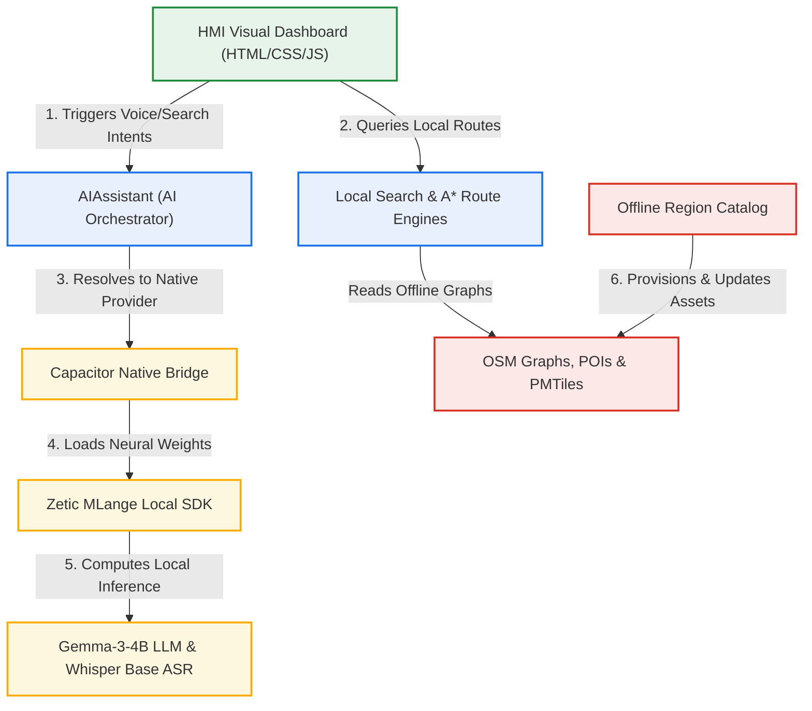

# Melange Maps — Premium On-Device AI Navigation

[](https://github.com/sudhanshu112233shukla/Maps.git)
[](https://github.com/sudhanshu112233shukla/Maps.git)
[](https://github.com/sudhanshu112233shukla/Maps.git)
[](https://github.com/sudhanshu112233shukla/Maps.git)

A premium, **100% offline-first smart navigation system** built specifically for low-connectivity environments, extreme safety assurance, and automotive HMI infotainment integration. Fully powered by local, **NPU-accelerated neural networks** and high-performance vector mapping.

---

## HMI Dashboard Interface Overview
The system features a **glassmorphic, state-of-the-art visual cockpit** optimized for high-glare automotive display dashboards:
* **Interactive Map Layer:** Seamless local MapLibre-rendered vector tiles with robust multi-touch and adaptive scaling.
* **Telemetry HUD Widget:** Real-time system battery status, temperature tracking, and safety alerting (automatically transitioning colors based on sustained CPU/GPU/NPU stress).
* **AR Turn-by-Turn Guidance:** Circular overlay HUD overlaying the live camera feed with dynamic, rotating lane-guidance arrows synchronized with navigation instructions.
* **Accessibility Excellence:** Built to **WCAG 2.1 AA** specifications with intuitive contrast, focused keyboard controls, and descriptive screen-reader tags (`aria-label`) on all actions.

---

## Architecture Blueprint & Data Flow



---

## Global Offline Region Provisioning Matrix

The platform supports robust, resumable, and validated **transactional offline asset downloads** across 8 primary global territories:

| Territory ID | Region Name | Map Engine | Local A* Graph | POI Index | Release Status |
| :--- | :--- | :---: | :---: | :---: | :---: |
| **`india`** | India | 100% Active | 38.5 MB | 1.7 KB | **RELEASED (Downloadable)** |
| **`skorea`** | South Korea | 100% Active | 38.3 MB | 983 B | **RELEASED (Downloadable)** |
| **`usa`** | United States | 100% Active | 38.3 MB | 960 B | **RELEASED (Downloadable)** |
| **`uk`** | United Kingdom | 100% Active | 38.0 MB | 965 B | **RELEASED (Downloadable)** |
| **`europe`** | Europe | 100% Active | 37.9 MB | 943 B | **RELEASED (Downloadable)** |
| **`japan`** | Japan | 100% Active | 38.3 MB | 968 B | **RELEASED (Downloadable)** |
| **`russia`** | Russia | 100% Active | 38.3 MB | 966 B | **RELEASED (Downloadable)** |
| **`australia`** | Australia | 100% Active | 38.5 MB | 984 B | **RELEASED (Downloadable)** |

---

## Local Neural Model Specifications

All neural workloads are fully self-contained on the client hardware. The orchestration layer classifies device memory tiers and selects the optimal profile automatically:

```
[Device RAM Allocation]
 ├── <= 4GB (Low-End)  ──> LLM: LiquidAI LFM 2.5 (1.2B)  ──> Speech: Whisper Base (74M)
 └── >  4GB (Mid-High) ──> LLM: Gemma 3 Instruct (4B)   ──> Speech: Whisper Base (74M)
```

### Active Model Configurations:
1. **Primary LLM:** `google/gemma-3-4b-it` (Gemma 3 4B Instruct — Local NPU execution).
2. **Fallback LLM:** `LiquidAI/LFM2.5-1.2B-Instruct` (LFM 2.5 1.2B — High efficiency).
3. **Voice ASR:** `ZETIC-ai/whisper-base-decoder` & `ZETIC-ai/whisper-base-encoder` (Whisper Base 74M — PCM float-buffer input).
4. **Local TTS:** `neuphonic/pocket-tts` (with automatic fallback to OS-native synthesizers).

---

## Local Development & Deployment

### Dependencies Installation:
```bash
npm install
```

### Launch Development Server:
```bash
npm run dev
```

### Production Web Build:
```bash
npm run build
```

---

## Mobile Build & Platforms Sync

### Android App Generation:
To keep your Gradle compilation fully isolated on Windows targets, run the checked‑in Gradle cache wrapper script:
```bash
npm run android:assemble:debug:g
```
*Forces compilation utilizing `G:\gradle-cache` for global configs, and isolated compilation parameters.*

### Sync Native Codebases:
Whenever assets under the `/public` or `/src` folders change, sync the platform bridges:
```bash
npm run cap:sync
```

---

## System Integrity Self-Checks

Run the unified test runner to execute all **20 automated system validation checks** (verifying graph integrity, model configs, storage budgets, offline queue states, and HMI telemetry):

```bash
npm run selfcheck:all
```

---

## Design Code Laws

1. **Safety Over AI:** Core route routing must always remain deterministic. Neural models are only used to assist ranking or voice query parsing; they can *never* override absolute driving safety constraints.
2. **Offline-Priority:** The application must boot, search, and navigate fully even if the device has zero cellular network connectivity.
3. **UI Thread Preservation:** All heavy geocoding, A* search, and graph traversal tasks must run in background threads, keeping the dashboard render performance locked at a smooth **60 FPS**.

---
*Developed for high-performance offline vehicle systems.*
